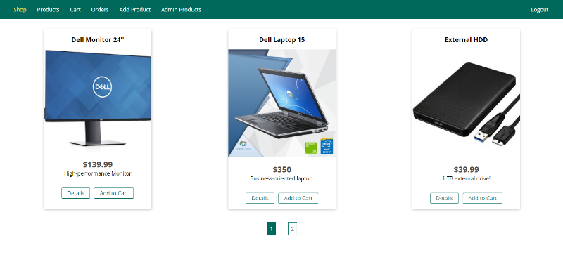

## [online-shop (click to see demo)](https://ol-shop.herokuapp.com/)

[NodeJS - The Complete Guide (incl. MVC, REST APIs, GraphQL) | Udemy](https://www.udemy.com/course/nodejs-the-complete-guide/)

## DEMO
[Click to see application in action](https://ol-shop.herokuapp.com/)

Application is deployed to Heroku using it's free hosting plan and Heroku will put it to sleep after some period of inactivity. So it is possible that first load of application will be slow (Heroku has to deploy it again). 

Also that is the reason why this repository contains certain images and why `util/heroku-db-normalizer.js` file is used (to prevent fetching image urls from database without images on server).

## Tags

- [v1.0](https://github.com/KulovacNedim/online-shop/tree/v5.0) - Persistence with file system implemented
- [v2.0](https://github.com/KulovacNedim/online-shop/tree/v5.0) - Persistence with MySql and Sequelize implemented
- [v3.0](https://github.com/KulovacNedim/online-shop/tree/v5.0) - Persistence with MongoDB implemented
- [v4.0](https://github.com/KulovacNedim/online-shop/tree/v5.0) - Persistence with Mongoose implemented
- [v5.0](https://github.com/KulovacNedim/online-shop/tree/v5.0) - Session, authentications, file upload, mailing with SendGrid, payments with Stripe implemented

## Clone

Clone this repo to your local machine using `https://github.com/KulovacNedim/online-shop.git`
and run `npm init` to install all dependencies

## Available Scripts

In the project directory, you can run:

#### `npm start` - to start the app in production mode
#### `npm run start:dev` - to start the app in development mode ([port: 3000](http://localhost:3000))
